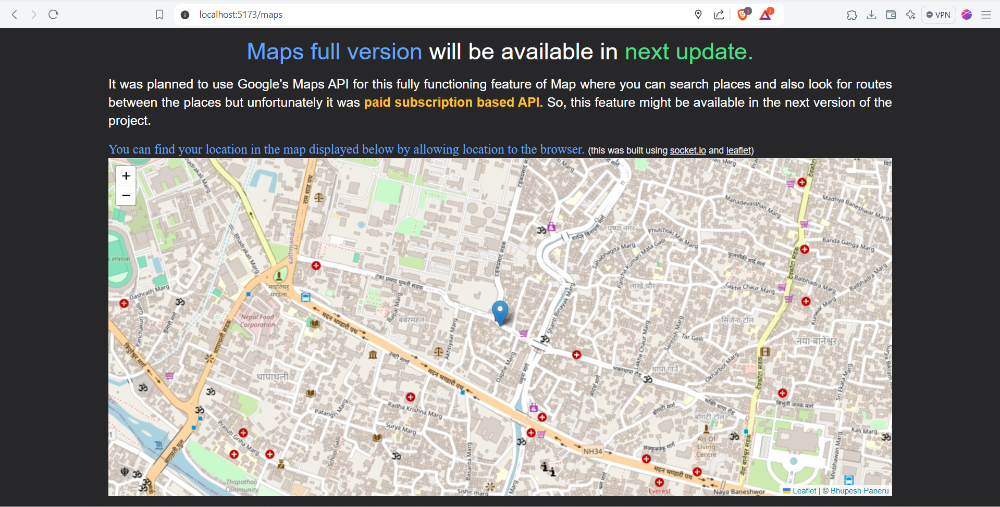

# GApp using Google API

## This project consists of various Google Applications such as:
- Gmail   (in progress)
- Maps (completed)
- OAuth 2.0 Authentication (completed)
- Gemini  (in process)
- Text to Image Generation  (in process)

## This project is built using
- NodeJS for backend,
- ReactJS for Frontend,
- MySQL for database,
- TailwindCSS for UI Design and Styling

# Snapshots

## 1. Landing Page

## 2. Mail

### 2.1 Create Mail

### 2.2 Inbox

### 2.3 Sent Mails

### 2.4 View Email

### 2.4 View Profile

## 3. Chat with GenAI using Gemini

## 4. Maps

## 5. Text to Image (available with next update)

